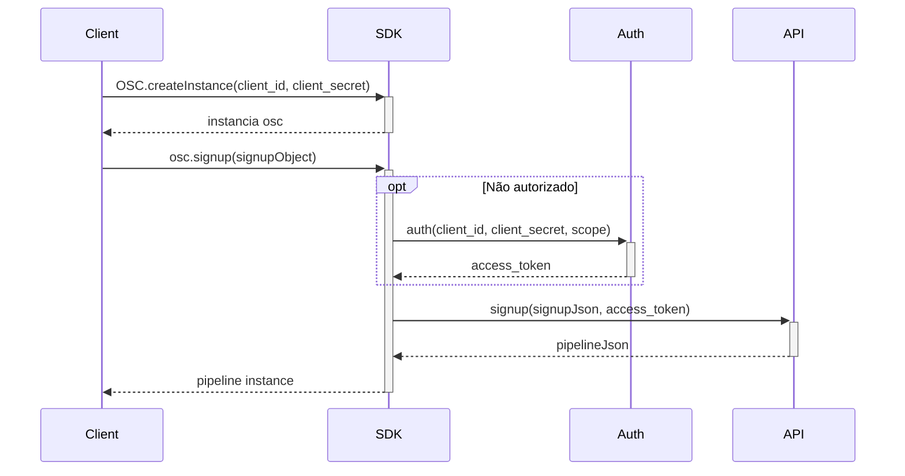

# osc-sdk-go

Branch: Features/TR-6298 - Escrita de exemplo Signup

 ## :blue_book: Descrição do Projeto

SDK para integração com a API da OSC.
    
## :rocket: Instalando

Para clonar o projeto e executar essa aplicação, você precisará do [Git](https://git-scm.com) e do [Go](https://golang.org/) instalados em seu computador.
Depois disso execute os seguintes comandos:

```bash
    # Clone esse repositório
    git clone https://github.com/Fitbank-Pagamentos-Eletronicos/osc-sdk-go.git
    
    # Entre no repositório
    cd osc-sdk-go
    cd src/main
    
    # Execute o projeto
    go run main.go


```

## :file_folder: Estrutura dos diretórios

    ├── osc-sdk-go
    │   ├── Idea
    │   ├── bin
    │   ├── pkg
    │   ├── src
    │   │    ├── domains
    │   │    ├── main
    │   │    ├── requests
    │   │    ├── utils
    ├── test


##  :hammer_and_wrench: Como executar os testes
    
    go test -v ./...  Executa todos os testes
    go test -v Address_test.go  Executa o teste de endereço

## :page_with_curl: Descrição do método

Para a requisição de _Signup_ é utilizado o método POST para fazer requisição para a API da OSC. Essa função recebe uma _struct_
_SigupMatch_ com todos os dados necessários para a requisição. A função retorna uma _string_ com o corpo da função. O corpo da retorna dados do cliente
como "id", "name", "cpf", "dataCriação", e " dataAtualização". Caso ocorra algum erro, a função retorna uma _string_ com a mensagem de erro.


## :dart: Exemplo de uso

### Signup

#### Fluxograma

#### Codificação
```Go
package main

import (
    "fmt", 
    "strings"
)

type OSC struct {
  clientId  string
  clientSecret string
  authorized bool
  api  *API
  auth *Auth
}


func (osc *OSC) CreateInstance(clientId string, clientSecret string) *OSC{
    // criar uma instância do objecto do OSC
    
    osc = &OSC{clientId: clientId, clientSecret: clientSecret}
    
    // retorna o valor do objeto instanciado
    return osc
}

func (osc *OSC) Signup(signupObject SignupObject) (pipelineJson PipelineJson, err error) {
	// verificar se o pedido de inscrição está autorizado
	if !osc.IsAuthorized() {
		// se não estiver autorizado, solicite um código de acesso ao serviço Auth
		accessToken, err := osc.auth.Auth(osc.clientId, osc.clientSecret, "write:pipelines")
		if err != nil {
			return pipelineJson, err
		}
	}
	// enviar o pedido de inscrição para o serviço API
	pipelineJson, err = osc.api.Signup(signupObject, accessToken)
	if err != nil {
		return pipelineJson, err
	}
	// devolver a instância pipeline
	return pipelineJson, nil
}

func (osc *OSC) IsAuthorized() bool {
	// verificar se o objeto OSC é definido como verdadeiro
	return osc.authorized
}

type Auth struct{}

func (api *API) Signup(signupObject SignupObject, accessToken string) (PipelineJson, error) {
	// enviar o pedido de inscrição ao API e devolve a instância de pipeline
	return PipelineJson{Pipeline: "pipeline instance"}, nil
}

```


