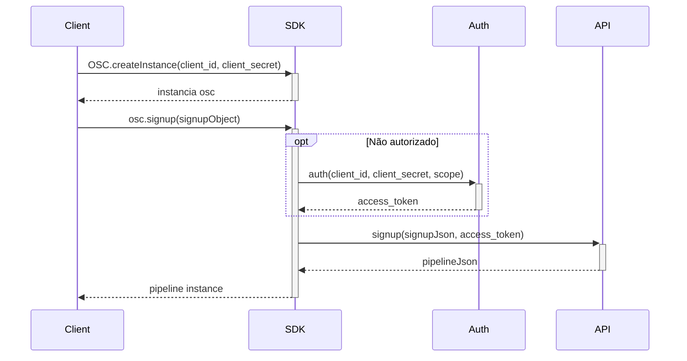
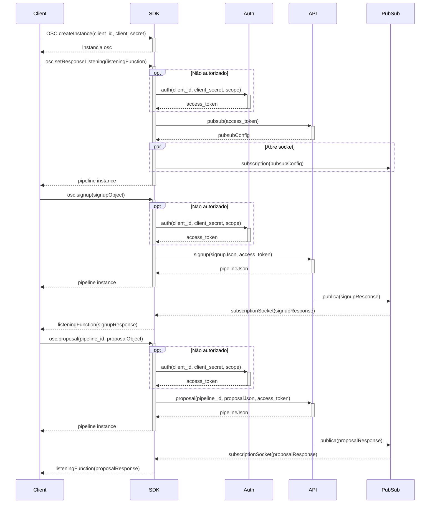

# osc-sdk-go

Branch: Features/TR-6298 - Escrita de exemplo Signup

 ## :blue_book: Descrição do Projeto

SDK para integração com a API da OSC.
    
## :rocket: Instalando

Para clonar o projeto e executar essa aplicação, você precisará do [Git](https://git-scm.com) e do [Go](https://golang.org/) instalados em seu computador.
Depois disso execute os seguintes comandos:

```bash
    # Clone esse repositório
    git clone https://github.com/Fitbank-Pagamentos-Eletronicos/osc-sdk-go.git
    
    # Entre no repositório
    cd osc-sdk-go
    cd src/main
    
    # Execute o projeto
    go run main.go


```

## :file_folder: Estrutura dos diretórios

    📦osc-sdk-go
    ┣ 📂bin
    ┣ 📂Idea
    ┣ 📂pkg
    ┣ 📂src
    ┃ ┣ 📂domains
    ┃ ┣ 📂main
    ┃ ┣ 📂requests
    ┃ ┗ 📂utils
    ┗ 📂test


##  :hammer_and_wrench: Como executar os testes
    
    go test -v ./...  Executa todos os testes
    go test -v Address_test.go  Executa o teste de endereço

## :page_with_curl: Descrição do método

Para a requisição de _Signup_ é utilizado o método POST para fazer requisição para a API da OSC. Essa função recebe uma _struct_
_SigupMatch_ com todos os dados necessários para a requisição. A função retorna uma _string_ com o corpo da função. O corpo da retorna dados do cliente
como "id", "name", "cpf", "dataCriação", e " dataAtualização". Caso ocorra algum erro, a função retorna uma _string_ com a mensagem de erro.


## :dart: Exemplo de uso

### Signup

#### Fluxograma

#### Codificação
```Go
package main

import (
    "fmt", 
    "strings"
)

type OSC struct {
  clientId  string
  clientSecret string
  authorized bool
  api  *API
  auth *Auth
}


func (osc *OSC) createInstance(clientId string, clientSecret string) *OSC {
  osc.clientId = clientId
  osc.clientSecret = clientSecret
  osc.authorized = false
  osc.api = new(API)
  osc.auth = new(Auth)
  
  return osc
}

```

### Signup + Proposal

#### Fluxograma

#### Codificação
```Go
package main

import (
    "fmt", 
    "strings"
    "cloud.google.com/go/pubsub"
    "google.golang.org/api/option"
)

type OSC struct {
  clientId  string
  clientSecret string
  authorized bool
  api  *API
  auth *Auth
}


func (osc *OSC) createInstance(clientId string, clientSecret string) *OSC {
  osc.clientId = clientId
  osc.clientSecret = clientSecret
  osc.authorized = false
  osc.api = new(API)
  osc.auth = new(Auth)
  
  return osc
}

func (osc *OSC) setResponseListening(listeningFunction func(response string)) {
  if !osc.authorized {
    osc.auth.auth(osc.clientId, osc.clientSecret, "pubsub")
    osc.authorized = true
  }
  
  pubsubConfig := osc.api.pubsub(osc.auth.accessToken)
  ctx := context.Background()
  client, err := pubsub.NewClient(ctx, pubsubConfig.ProjectId, option.WithCredentialsJSON([]byte(pubsubConfig.Credentials)))
  if err != nil {
    fmt.Println(err)
  }
  defer client.Close()
  
  sub := client.Subscription(pubsubConfig.Subscription)
  err = sub.Receive(ctx, func(ctx context.Context, msg *pubsub.Message) {
    msg.Ack()
    listeningFunction(string(msg.Data))
  })
  if err != nil {
    fmt.Println(err)
  }
}

```


