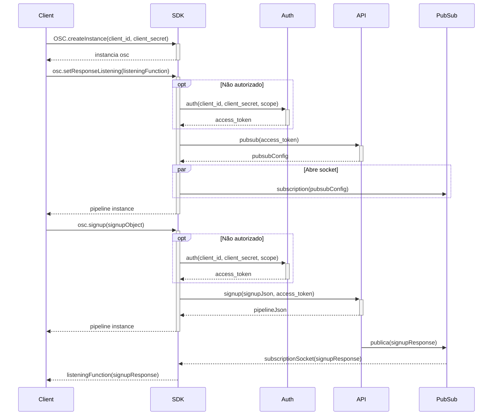

# osc-sdk-go

Branch: Features/TR-6298 - Escrita de exemplo Signup

## Descrição do Projeto

SDK para integração com a API da OSC.
    

## Estrutura dos diretórios

        
        ├── osc-sdk-go
        │   ├── Idea
        │   ├── bin
        │   ├── pkg
        │   ├── src
        │   │   ├── domains
        │   │   ├── main
        │   │   ├── requests
        │   │   ├── utils
        ├── test
        │   └── ...
       

## Como executar os testes
    
    go test -v ./...  Executa todos os testes
    go test -v Address_test.go  Executa o teste de endereço

## Descrição dos métodos

Para a requisição de _Signup_ é utilizado o método POST para fazer requisição para a API da OSC. Essa função recebe uma _struct_
_SigupMatch_ com todos os dados necessários para a requisição. A função retorna uma _string_ com o corpo da função. O corpo da retorna dados do cliente
como "id", "name", "cpf", "dataCriação", e " dataAtualização". Caso ocorra algum erro, a função retorna uma _string_ com a mensagem de erro.

## Exemplo de uso

### Signup

#### Fluxograma

#### Codificação
```Go
package main
import ("fmt", "strings")

type OSC struct {
  clientId  string
  clientSecret string
  authorized bool
  api  *API
  auth *Auth
}


func (osc *OSC) CreateInstance(clientId string, clientSecret string) *OSC{
    // criar uma instância do objecto do OSC
    
    osc = &OSC{clientId: clientId, clientSecret: clientSecret}
    
    // retorna o valor do objeto instanciado
    return osc
}

```

### Signup + respostas

Lorem ipsum dolor sit amet, consectetur adipiscing elit. Cras nulla lorem, rhoncus id placerat at, dictum vitae lectus. Etiam tristique pellentesque lorem, eu consequat tellus pulvinar et. Vestibulum diam arcu, eleifend quis vestibulum at, auctor in ligula. Ut ut hendrerit nunc, a facilisis nisl. Nulla sollicitudin interdum venenatis. Etiam at.

#### Fluxograma

#### Codificação
```
!
```


### Signup + Proposal

Lorem ipsum dolor sit amet, consectetur adipiscing elit. Cras nulla lorem, rhoncus id placerat at, dictum vitae lectus. Etiam tristique pellentesque lorem, eu consequat tellus pulvinar et. Vestibulum diam arcu, eleifend quis vestibulum at, auctor in ligula. Ut ut hendrerit nunc, a facilisis nisl. Nulla sollicitudin interdum venenatis. Etiam at.

#### Fluxograma

#### Codificação
```
!
```

### Fluxo Completo

Lorem ipsum dolor sit amet, consectetur adipiscing elit. Cras nulla lorem, rhoncus id placerat at, dictum vitae lectus. Etiam tristique pellentesque lorem, eu consequat tellus pulvinar et. Vestibulum diam arcu, eleifend quis vestibulum at, auctor in ligula. Ut ut hendrerit nunc, a facilisis nisl. Nulla sollicitudin interdum venenatis. Etiam at.

#### Fluxograma

#### Codificação
```
!
```
# !!!!!
#### Codificação
    package requests

    import (
        "fmt"
        "net/http"
        "io/ioutil"
        "strings"
        "encoding/json"
        "modulo/src/domains"
    )

    func SignupMatchRequest() string {

        url:= "https://demo-api.easycredito.com.br/api/external//v2.1/process/signup"
        method := "POST"
    
        simpleToJson, _ := json.Marshal(data)
    
        payload := strings.NewReader(string(simpleToJson))
    
        client := &http.Client{}
        req, err := http.NewRequest(method, url, payload)
    
        if err != nil {
            fmt.Println(err)
            return  ""
        }
        
        req.Header.Add("Content-Type", "application/json")
        req.Header.Add("Accept", "application/json")
        req.Header.Add("Authorization", "Bearer " + GetToken()) // Para a autenticação é necessário o token esse token é feito na função GetToken()
    
        res, err := client.Do(req)
        if err != nil {
            fmt.Println(err)
            return ""
        }
        defer res.Body.Close()
    
        body, err := ioutil.ReadAll(res.Body)
    
        if err != nil {
            fmt.Println(err)
            return ""
        }
    
        return string(body)
}

### Função GetToken

    func GetToken () string {
        if auth.Access_token == "" || auth.Expire_at == "" {
        auth = Auth()
        return auth.Access_token

    }

    var expireAt, _ = time.Parse("2006-01-02T15:04:05.000Z", auth.Expire_at)

    if time.Now().After(expireAt) {
        auth = Auth()
        return auth.Access_token
    }

    return auth.Access_token

}


   
    

## Execução 
Para a execução desse função _SignupMatchRequest_ é necessário importar o pacote _requests_ e chamar a função _SignupMatchRequest_.
package main.

    import (
        "fmt"
        "modulo/src/requests"
    )

    func main() {
       requests.SignupMatchRequest()
       
    }

### Execução da função main

    go run main.go

### Retorno da função
        {
            "id": "1k8l4f7bhv8jc33p4ardd847b41f7694041879443333f9d5513",
            "name": "Carlos Alexandre",
            "status": "SIGNUP_ANALISIS",
            "cpf": 36761586011,
            "dateCreated": "2022-12-26T12:22:05.949Z",
            "lastUpdated": "2022-12-26T12:22:05.949Z"
        }
