```mermaid
sequenceDiagram
    participant Client
    participant SDK
    participant Auth
    participant API
    participant PubSub

 

    Client->>+SDK: OSC.createInstance(client_id, client_secret)
    SDK-->>-Client: instancia osc

    Client->>+SDK: osc.setResponseListening(listeningFunction)
        opt Não autorizado 
            SDK->>+Auth: auth(client_id, client_secret, scope)
            Auth-->>-SDK: access_token
        end
        SDK->>+API: pubsub(access_token)
        API-->>-SDK: pubsubConfig
        par Abre socket
            SDK->>PubSub: subscription(pubsubConfig)
        end
    SDK-->>-Client: pipeline instance

    Client->>+SDK: osc.signup(signupObject)
        opt Não autorizado 
            SDK->>+Auth: auth(client_id, client_secret, scope)
            Auth-->>-SDK: access_token
        end
        SDK->>+API: signup(signupJson, access_token)
        API-->>-SDK: pipelineJson
    SDK-->>-Client: pipeline instance
    API->>PubSub: publica(signupResponse)
    PubSub-->>SDK: subscriptionSocket(signupResponse)
    SDK-->>Client: listeningFunction(signupResponse)

    Client->>+SDK: osc.proposal(pipeline_id, proposalObject)
        opt Não autorizado 
            SDK->>+Auth: auth(client_id, client_secret, scope)
            Auth-->>-SDK: access_token
        end
        SDK->>+API: proposal(pipeline_id, proposalJson, access_token)
        API-->>-SDK: pipelineJson
    SDK-->>-Client: pipeline instance

    API->>PubSub: publica(proposalResponse)
    PubSub-->>SDK: subscriptionSocket(proposalResponse)
    SDK-->>Client: listeningFunction(proposalResponse)

    par Continuara recevbendo atualização de status durante o fluxo
        API->>PubSub: publica(proposalStatusUpdateResponse)
        PubSub-->>SDK: subscriptionSocket(proposalResponse)
        SDK-->>Client: listeningFunction(proposalResponse)
    and Nesta etapa o envio de documentos esta liberado
        Client->>+SDK: osc.document(pipeline_id, documentObject)
            opt Não autorizado 
                SDK->>+Auth: auth(client_id, client_secret, scope)
                Auth-->>-SDK: access_token
            end
            SDK->>+API: proposal(pipeline_id, documentJson, access_token)
            API-->>-SDK: documentResponseJson
        SDK-->>-Client: documentResponse instance
    and Caso alguma proposta retorne que tem contratos para asinatura
        Client->>+SDK: osc.getContracts(customerServiceNumber)
            opt Não autorizado 
                SDK->>+Auth: auth(client_id, client_secret, scope)
                Auth-->>-SDK: access_token
            end
            SDK->>+API: getContracts(customerServiceNumber, access_token)
            API-->>-SDK: contractsResponseJson
        SDK-->>-Client: contractsResponse instance

        Client->>+SDK: osc.SignContracts(customerServiceNumber, contractsObject)
            opt Não autorizado 
                SDK->>+Auth: auth(client_id, client_secret, scope)
                Auth-->>-SDK: access_token
            end
            SDK->>+API: SignContracts(customerServiceNumber, contractsObject, access_token)
            API-->>-SDK: signContractsResponseJson
        SDK-->>-Client: signContractsResponse instance
    end
```

# osc-sdk-go

Branch: Features/TR-6298 - Escrita de exemplo Signup

 ## :blue_book: Descrição do Projeto

SDK para integração com a API da OSC.
    
## :rocket: Instalando

Para clonar o projeto e executar essa aplicação, você precisará do [Git](https://git-scm.com) e do [Go](https://golang.org/) instalados em seu computador.
Depois disso execute os seguintes comandos:

```bash
    # Clone esse repositório
    git clone https://github.com/Fitbank-Pagamentos-Eletronicos/osc-sdk-go.git
    
    # Entre no repositório
    cd osc-sdk-go
    cd src/main
    
    # Execute o projeto
    go run main.go


```

## :file_folder: Estrutura dos diretórios

    📦osc-sdk-go
    ┣ 📂bin
    ┣ 📂Idea
    ┣ 📂pkg
    ┣ 📂src
    ┃ ┣ 📂domains
    ┃ ┣ 📂main
    ┃ ┣ 📂requests
    ┃ ┗ 📂utils
    ┗ 📂test


##  :hammer_and_wrench: Como executar os testes


```bash
    # Entrar no diretório de testes
    cd test
    
    # Executar todos os testes
    go test -v ./...  Executa todos os testes
    
    # Execute apenas um test
    go test -v Address_test.go


```
## :page_with_curl: Métodos

Os métodos estáo disponíveis na pasta `src/requests` e são:
 
- [x] `OAuth` - Criação do token de autenticação para o uso em endpoints. O resultado  é o `AuthSucess`.
- [x] `DocumentRequest` - Envia um documento para análise. O resultado é o `DocumentResponse`.
- [x] `ProposalRequest` - Recolhe e valida dados necessários para a criação de propostas de acordo com os tipos de produtos selecionados. O resultado é o `PipelineProposal`.
- [x] `PubSub` - Obtém o ID do projeto, ID do tópico e outras coisas. O resultado é o `PubSubResponse`.
- [x] `PubsubSubscribe` - Usa os dados retornados do `PubSub` e cria um ouvinte.
- [x] `SimpleSignup` - Realiza o cadastro de usuários(pode retornar erro caso o usuário já exista). O resultado é o `SignupResponse`.
- [x] `SignupMatchRequest` - Faz a inscrição de usuários e retorna os produtos de créditos com maior chance de aprovação. O resultado é o `SignupMatchResponse`. 
- [x]  `OSC` - Realiza a criação de instancias de OSC.

## :dart: Exemplo de uso

### Signup

#### Fluxograma

#### Codificação
```Go
package main

import (
    "fmt", 
    "strings"
)

type OSC struct {
  clientId  string
  clientSecret string
  authorized bool
  api  *API
  auth *Auth
}


func (osc *OSC) createInstance(clientId string, clientSecret string) *OSC {
  osc.clientId = clientId
  osc.clientSecret = clientSecret
  osc.authorized = false
  osc.api = new(API)
  osc.auth = new(Auth)
  
  return osc
}

func (osc *OSC) signup(signupObject SignupMatch) string {
  if !osc.authorized {
    osc.authorized = true
    osc.auth.auth(osc.clientId, osc.clientSecret, "signup")
  }
  signupJson := osc.api.signup(signupObject, osc.auth.accessToken)
  return signupJson
}

```
### Signup + Proposal
#### Fluxograma

#### Codificação
```Go
package main

import (
    "fmt", 
    "strings"
    "cloud.google.com/go/pubsub"
    "google.golang.org/api/option"
)

type OSC struct {
  clientId  string
  clientSecret string
  authorized bool
  api  *API
  auth *Auth
}


func (osc *OSC) createInstance(clientId string, clientSecret string) *OSC {
  osc.clientId = clientId
  osc.clientSecret = clientSecret
  osc.authorized = false
  osc.api = new(API)
  osc.auth = new(Auth)
  
  return osc
}

func (osc *OSC) setResponseListening(listeningFunction func(response string)) {
  if !osc.authorized {
    osc.auth.auth(osc.clientId, osc.clientSecret, "pubsub")
    osc.authorized = true
  }

}
func (osc *OSC) Proposal(pipelineId string, proposalObject interface{}) {
  if !osc.authorized {
    osc.auth.auth(osc.clientId, osc.clientSecret, "pubsub")
    osc.authorized = true
  }
}

```
### PubSub

#### Fluxograma

#### Codificação
```Go
 package main
 
 import (
    "fmt", 
    "strings"
    "cloud.google.com/go/pubsub"
    "google.golang.org/api/option"
 )

    type OSC struct {
      clientId  string
      clientSecret string
      authorized bool
      api  *API
      auth *Auth
    }
    

    func (osc *OSC) createInstance(clientId string, clientSecret string) *OSC {
      osc.clientId = clientId
      osc.clientSecret = clientSecret
      osc.authorized = false
      osc.api = new(API)
      osc.auth = new(Auth)
      
      return osc
          
    }
    
    func (osc *OSC) setResponseListening(listeningFunction func(message *pubsub.Message)) {
       if !osc.authorized {
          osc.authorized = true
          osc.auth.authorize(osc.clientId, osc.clientSecret, "pubsub")
       }
          
       pubsubConfig := osc.api.pubsub(osc.auth.accessToken)
       ctx := context.Background()
       client, err := pubsub.NewClient(ctx, pubsubConfig.ProjectId, option.WithCredentialsJSON([]byte(pubsubConfig.Credentials)))
       if err != nil {
         fmt.Println(err)
       }
       defer client.Close()
          
       sub := client.Subscription(pubsubConfig.Subscription)
       err = sub.Receive(ctx, func(ctx context.Context, msg *pubsub.Message) {
          msg.Ack()
          listeningFunction(string(msg.Data))
       })
       if err != nil {
         fmt.Println(err)
       }
    }
```
### Fluxo completo

#### Fluxograma

#### Codificação
```Go
package main
 
 import (
    "fmt", 
    "strings"
    "cloud.google.com/go/pubsub"
    "google.golang.org/api/option"
 )

    type OSC struct {
      clientId  string
      clientSecret string
      authorized bool
      api  *API
      auth *Auth
    }
    
     func (osc *OSC) setResponseListening(listeningFunction func(message *pubsub.Message)) {
       if !osc.authorized {
          osc.authorized = true
          osc.auth.authorize(osc.clientId, osc.clientSecret, "pubsub")
       }
     
     func (osc *OSC) Proposal(pipelineId string, proposalObject interface{}) {
         if !osc.authorized {
            osc.auth.auth(osc.clientId, osc.clientSecret, "pubsub")
            osc.authorized = true
         }
     }
     
     func SinupMatchRequest(signupMatch *SignupMatch, auth *Auth) {
         signupMatchJson, _ := json.Marshal(signupMatch)
         signupMatchResponseJson := api.signup(signupMatchJson, auth.accessToken)
         signupMatchResponse := SignupMatchResponse{}
         json.Unmarshal(signupMatchResponseJson, &signupMatchResponse)
         return signupMatchResponse
     }

```

